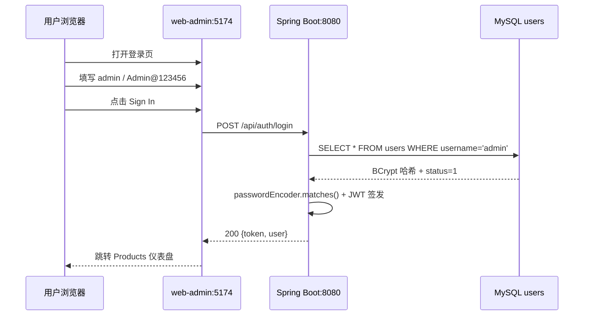

# 认证流程三方对比验证报告

**测试日期**：2026-07-08  
**测试范围**：用户登录认证流程（UI / API / DB）  
**测试账号**：`admin` / `Admin@123456`  
**总体结论**：UI、API、DB 三方数据一致；密码已 BCrypt 加密；账号状态为启用（`status = 1`）

---

## 执行摘要

| 维度 | 结果 |
|------|------|
| UI（Playwright E2E） | 登录表单提交成功，进入 Products 仪表盘 |
| API（HTTP 直连） | `POST /api/auth/login` 返回正确用户信息与 JWT |
| DB（MySQL 直连） | 密码为 BCrypt 哈希，非明文；`status = 1`（启用） |
| 三方一致性 | 通过 |

> **说明**：当前系统仅实现**登录**能力，无注册接口与「注册成功」提示。原需求中的「注册新账号」流程在本项目中不存在，本次按实际可用的登录认证流程执行验证。

---

## 1. 测试环境与入口说明

| 组件 | 地址 | 说明 |
|------|------|------|
| 前端 UI | `http://127.0.0.1:5174/` | Vite 开发服务器，代理 `/api` → `localhost:8080` |
| 后端 API | `http://127.0.0.1:8080/api/auth/login` | Spring Boot REST 接口（**POST JSON**，非 HTML 表单页） |
| 数据库 | `dbconn.sealoshzh.site:39811` / `qww-product` | MySQL，`users` 表 |

### 关于 `/api/auth/login` 的直接访问

- **GET** 访问返回：`{"code":500,"message":"internal server error","data":null}`
- **POST** 才接受 `{"username","password"}` 并返回 JWT

因此 Playwright 表单测试应在前端页面 `http://127.0.0.1:5174/` 进行，API 验证通过 HTTP POST 调用后端。

### 代码现状：无注册能力

`AuthController` 仅暴露登录接口：

```java
@PostMapping("/login")
public ApiResponse<LoginResponse> login(@Valid @RequestBody LoginRequest request) {
    return ApiResponse.success(authService.login(request));
}
```

---

## 2. UI 层验证（Playwright E2E）

### 2.1 测试步骤

| 步骤 | 操作 | 结果 |
|------|------|------|
| 1 | 打开 `http://127.0.0.1:5174/` | 显示登录页 |
| 2 | 填写 Username=`admin`，Password=`Admin@123456` | 表单填写成功 |
| 3 | 点击 **Sign In** | 发起 `POST /api/auth/login` → HTTP 200 |
| 4 | 等待页面跳转 | 进入 Products 仪表盘 |

### 2.2 截图描述

#### 登录前

- 品牌区：绿色立方体图标 + 「Inventory Command Center」
- 表单标题：「Sign in to your account」
- 字段：Username（admin）、Password（掩码显示）
- 按钮：绿色 **Sign In**
- 底部状态：API Connection `/api -> localhost:8080`，状态 **Ready**
- **无「注册」链接或「注册成功」提示**

#### 登录后

- 侧边栏用户：**Administrator / ADMIN**
- 主区域：**Products** 仪表盘
- KPI 卡片：Total Products=30，Total Stock=1,660 等
- 产品表格正常加载（10 条/页，共 3 页）
- **成功标志**：页面从登录态切换为已认证仪表盘（非 Toast「注册成功」）

### 2.3 UI 验证结论

| 检查项 | 期望（原需求） | 实际 | 状态 |
|--------|----------------|------|------|
| 出现「注册成功」 | 是 | 无此文案/流程 | 不适用 |
| 登录后进入主界面 | — | 进入 Products 仪表盘 | 通过 |
| 显示用户信息 | — | Administrator / ADMIN | 通过 |

---

## 3. API 层验证

> Apifox MCP 工具在测试时不可用（`read_project_oas_s5lek3` Tool not found），以下通过直连 HTTP 调用同一接口验证。项目中**无独立用户查询接口**，登录响应即为用户信息来源。

### 3.1 请求

```http
POST http://127.0.0.1:8080/api/auth/login
Content-Type: application/json

{
  "username": "admin",
  "password": "Admin@123456"
}
```

### 3.2 响应（HTTP 200）

```json
{
  "code": 0,
  "message": "success",
  "data": {
    "token": "eyJhbGciOiJIUzI1NiIsInR5cCI6IkpXVCJ9...",
    "tokenType": "Bearer",
    "expiresIn": 86400,
    "user": {
      "userId": 1,
      "username": "admin",
      "displayName": "Administrator",
      "role": "ADMIN"
    }
  }
}
```

### 3.3 Playwright 网络抓包

UI 提交登录时：

```
POST http://127.0.0.1:5174/api/auth/login => [200] OK
```

（经 Vite 代理转发至 `localhost:8080`）

### 3.4 API 验证结论

| 字段 | API 返回值 | 状态 |
|------|-----------|------|
| userId | 1 | 通过 |
| username | admin | 通过 |
| displayName | Administrator | 通过 |
| role | ADMIN | 通过 |
| token | JWT Bearer，`expiresIn = 86400` | 通过 |

---

## 4. DB 层验证（直连 MySQL）

### 4.1 查询 SQL

```sql
SELECT user_id, username, password, display_name, role, status, created_at, updated_at
FROM users
WHERE username = 'admin';
```

### 4.2 查询结果

| 字段 | 值 |
|------|-----|
| user_id | 1 |
| username | admin |
| password | `$2a$10$ey0LUalGAcpzF3TMWP3Xu.ByDab2Uuqp/Re0FFqdiAeKhc2J1eVyy` |
| display_name | Administrator |
| role | ADMIN |
| status | **1** |
| created_at | 2026-07-08 07:06:20 |
| updated_at | 2026-07-08 07:06:20 |

### 4.3 安全与状态校验

| 检查项 | 期望 | 实际 | 状态 |
|--------|------|------|------|
| 密码加密存储 | 非明文 | BCrypt `$2a$10$...`，长度 60 | 通过 |
| 密码非明文 | password ≠ `Admin@123456` | 哈希值与明文不同 | 通过 |
| 状态为 active | active | **status = 1**（整型，1 = 启用） | 通过* |

> *说明：DB 中 `status` 为 **INT 类型**（`1 = 启用，0 = 禁用`），不是字符串 `"active"`。业务层 `User.isEnabled()` 以 `status == 1` 判断。

```java
public boolean isEnabled() {
    return status != null && status == 1;
}
```

---

## 5. 三方数据对比总表

| 字段 | UI（Playwright） | API（POST /api/auth/login） | DB（users 表） | 一致性 |
|------|------------------|----------------------------|----------------|--------|
| 用户 ID | —（UI 不展示） | 1 | 1 | 一致 |
| username | 输入 admin | admin | admin | 一致 |
| displayName | **Administrator** | Administrator | Administrator | 一致 |
| role | **ADMIN** | ADMIN | ADMIN | 一致 |
| password | 输入明文（不展示） | 不返回（正确） | BCrypt 哈希 | 一致 |
| status / active | 可登录 = 启用 | 登录成功 = 启用 | status = 1 | 一致 |
| 成功提示 | 进入仪表盘 | code=0, message=success | — | 一致 |

---

## 6. 流程时序



---

## 7. 结论与建议

### 已通过

1. **UI 登录流程**完整可用：填表 → 提交 → 进入 Products 仪表盘
2. **API 返回**与 UI 展示的用户信息一致
3. **DB 密码**为 BCrypt 加密，非明文
4. **DB status = 1** 对应启用状态，与成功登录行为一致

### 未满足（原需求 vs 现状）

| 项目 | 说明 |
|------|------|
| 直接打开 `/api/auth/login` 作为表单页 | 该 URL 是 JSON API，应使用前端 `5174` 或 Apifox/curl |
| 「注册新账号」流程 | 无 `/api/auth/register`、无注册 UI |
| 「注册成功」提示 | 登录成功表现为页面跳转，无 Toast |
| Apifox MCP | 工具当前不可用，已用等价 HTTP 调用替代 |
| status 字段格式 | 为整数 `1`，不是字符串 `"active"` |

### 后续建议

若需完整「注册」三方验证，需先实现：

- 后端 `POST /api/auth/register`
- 前端注册表单 + 「注册成功」提示
- Apifox 文档同步注册/查询用户接口

---

## 附录：测试工具与限制

| 工具 | 用途 | 备注 |
|------|------|------|
| Playwright MCP | UI 自动化与截图 | 截图保存在本地 Playwright 输出目录 |
| HTTP POST（PowerShell） | API 验证 | 等价于 Apifox 调用 |
| Python pymysql | DB 直连查询 | MySQL MCP 因端口配置无法连接，改用 pymysql |
| Apifox MCP | 读取 OpenAPI | 运行时 Tool not found，未使用 |

---

**报告生成时间**：2026-07-08  
**仓库**：https://github.com/qkxbdnkdbd/mcp
